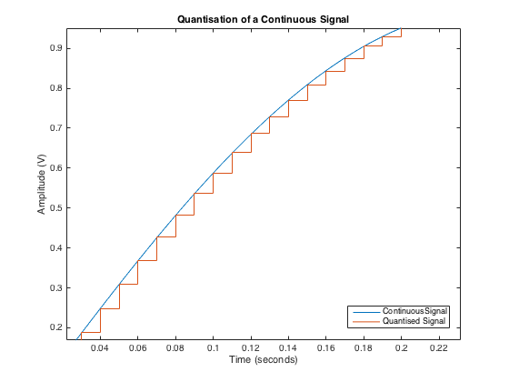
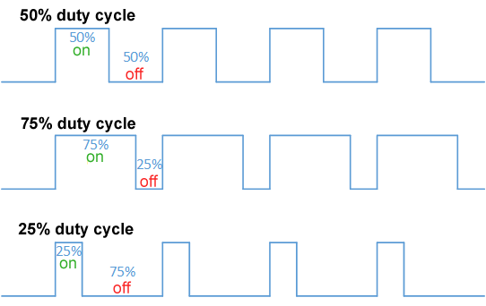

ADC
---
Um adc eh um hardware capaz de converter grandezas continuas, portanto, analogicas em digitais, discretas. 
tres caracteristicas importantes desse tipo de hardware sao : 

- `Resolucao `: Qual o tamanho da palavra em bits que o modulo faz a conversao
- `Effective number of Bits`: Quantos bits da conversao nao possuem ruido
- `Taxa de Amostragem Maxima`: O quao rapido o modulo eh capaz de realizar uma conversao 

A resolucao implica na `quantizacao` do sinal. `Quantizacao` : Converter um valor que eh continuo em amplitude em um valor que eh discreto em amplitude 

Usando o handout, dado o exmeplo que o ADC varia de [0; 3,3]V e possui 12 bits de resolucao. 
Isso implica que um bit vale : 
$$
\mathrm{bit} = \frac{3,3 - 0}{2^{12}} 
$$

Uma imagem que mostra bem como eh o processo de quantizacao eh essa: 


A resolucao nesse grafico seria o numero de degraus dele. 

Tensão Real     →    Valor Digital
0.0V           →         0
0.8mV          →         1  
1.6mV          →         2
3.2mV          →         4
...            →        ...
3.3V           →       4095


Snippets do uso do ADC: 

```c 

#include <stdio.h>
#include "pico/stdlib.h"
#include "hardware/gpio.h"
#include "hardware/adc.h"

int main() {
    stdio_init_all();
    printf("ADC Example, measuring GPIO27\n");

    adc_init();

    // Make sure GPIO is high-impedance, no pullups etc
    adc_gpio_init(27);
    // Select ADC input 1 (GPIO27)
    adc_select_input(1);

    while (1) {
        // 12-bit conversion, assume max value == ADC_VREF == 3.3 V
        const float conversion_factor = 3.3f / (1 << 12);
        uint16_t result = adc_read();
        printf("Raw value: 0x%03x, voltage: %f V\n", result, result * conversion_factor);
        sleep_ms(500);
    }
}
```


PWM
---



Falamos em `dutycycle` para nos referirmos a quanto tempo o sinal do PWM permanece em nivel alto. Um duty cycle de 40% indica que o sinal fica por 40% do tempo em nivel alto e 60% em nivel baixo. 

$$

\mathrm{frequencia} = f = \frac{1}{T}, \quad
\mathrm{DutyCycle} = D = \frac{T_{on}}{T}, \quad

Logo: 
f \neq D

$$


`Snippet PWM`:


```c
/**
 * Copyright (c) 2020 Raspberry Pi (Trading) Ltd.
 *
 * SPDX-License-Identifier: BSD-3-Clause
 */

// Output PWM signals on pins 0 and 1

#include "pico/stdlib.h"
#include "hardware/pwm.h"

const int PWM_0_PIN = 28;

int main() {
    // Tell GPIO they are allocated to the PWM
    gpio_set_function(PWM_0_PIN, GPIO_FUNC_PWM);

    // Find out which PWM slice is connected to GPIO
    uint slice_num = pwm_gpio_to_slice_num(PWM_0_PIN);

    // pwm freq
    pwm_set_clkdiv(slice_num, 125); // pwm clock should now be running at 1MHz

    // Set period of 100 cycles (0 to 99 inclusive)
    pwm_set_wrap(slice_num, 100);

    // Set channel A output high for one cycle before dropping
    // PWM set to 30%
    pwm_set_chan_level(slice_num, PWM_CHAN_A, 70);

    // Set the PWM running
    pwm_set_enabled(slice_num, true);

    while(1){


    }
}
```


Para multiplos PWM's
```c
#define PWM_GP27
#define PWM_GP15

void init_pwm(int pwm_pin_gp, uint resolution, uint *slice_num, uint *chan_num) {
    gpio_set_function(pwm_pin_gp, GPIO_FUNC_PWM);
    uint slice = pwm_gpio_to_slice_num(pwm_pin_gp);
    uint chan = pwm_gpio_to_channel(pwm_pin_gp);
    pwm_set_clkdiv(slice, 125); // pwm clock should now be running at 1MHz
    pwm_set_wrap(slice, resolution);
    pwm_set_chan_level(slice, PWM_CHAN_A, 0);
    pwm_set_enabled(slice, true);

    *slice_num = slice;
    *chan_num = chan;
}


void main() {
    int pwm_0_slice, pwm_1_chan;
    int pwm_1_slice, pwm_1_chan;
    init_pwm(PWM_GP27, 256, &pwm_0_slice, &pwm_0_chan);
    init_pwm(PWM_GP15, 256, &pwm_1_slice, &pwm_1_chan);

    while(1) {
            for (int i=0; i < 256; i++){
                pwm_set_chan_level(pwm_0_slice, pwm_0_chan, i);
                pwm_set_chan_level(pwm_1_slice, pwm_1_chan, 256 - i);
                sleep_ms(10);
            }
    }
}
```


Frequencia do PWM: Indica o efeito de constancia
Duty cycle: Indica a intensidade do brilho 